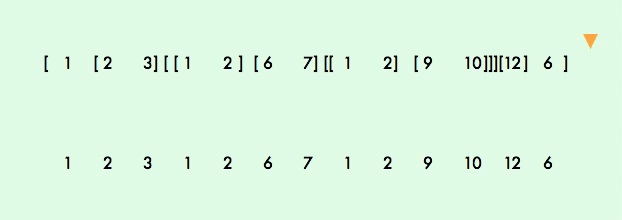

**the function returns a new flat array, the default value is depth = 1.**

`flatten([1, ['string', [null, [4, [undefined, [6]]]]]])
=> [1, 'string', [null, [4, [undefined, [6]]]]]`

`flatten([1, ['string', [null, [4, [undefined, [6]]]]]], 3)
=> [1, 'string', null, 4, [undefined, [6]]]`

`flatten([1, ['string', [null, [4, [undefined, [6]]]]]], Infinity)
=> [1, "string", null, 4, undefined, 6]`

